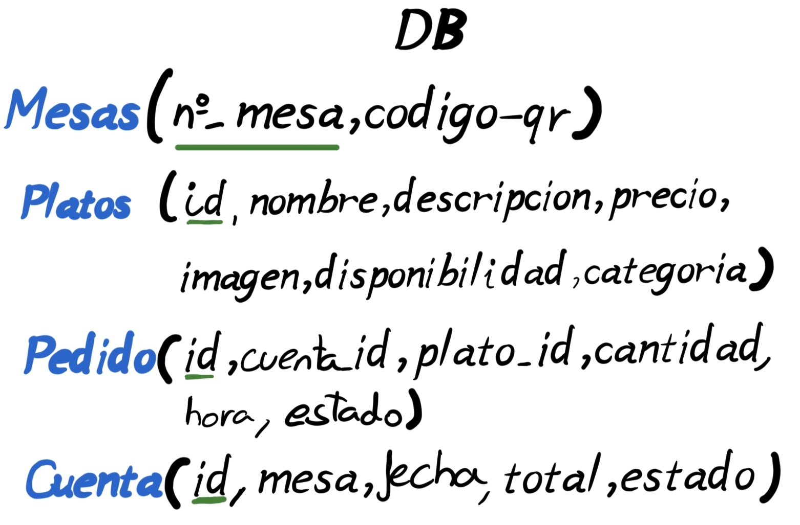
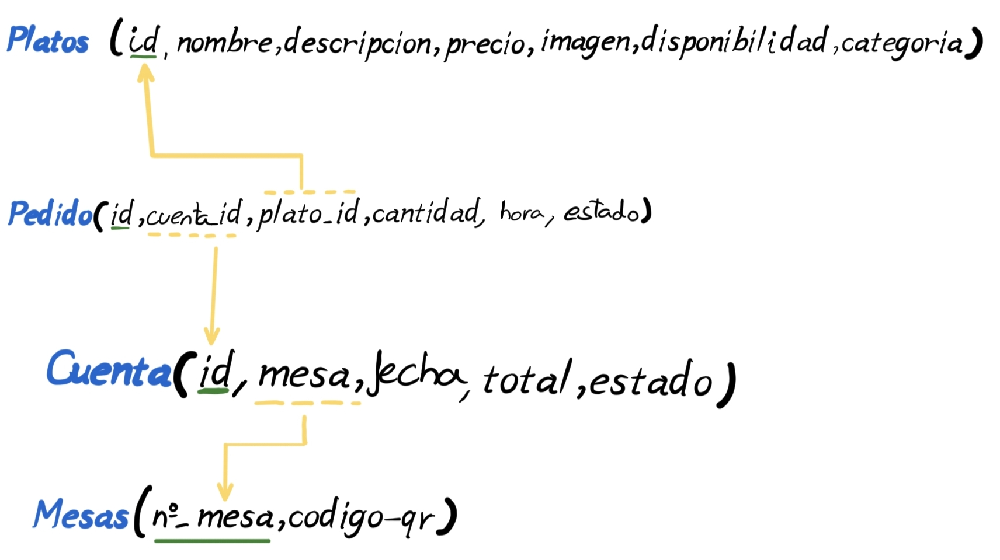

# Sistema de Pedidos QR — Proyecto Web y App Móvil

## Índice

1. [Descripción del proyecto](#descripción-del-proyecto)
2. [Diseño](#diseño)
   - [Descripción general](#11-descripción-general)
   - [Diseño de la base de datos](#12-diseño-de-la-base-de-datos)
   - [Diseño de la Interfaz de Usuario](#13-diseño-de-la-interfaz-de-usuario-uiux)
   - [Diseño Backend](#14-diseño-backend-api-rest--websockets)
   - [Diseño Frontend](#15-diseño-frontend-web-y-app-móvil)
3. [Implementación](#implementación)

---

## Descripción del proyecto

Este proyecto tiene como objetivo demostrar los conocimientos adquiridos, afianzándolos mediante un desarrollo personal, al tiempo que se exploran nuevas tecnologías necesarias para su realización.

El proyecto consiste en la creación de un **sistema de pedidos mediante códigos QR** para un restaurante o cafetería.

El desarrollo comenzará con el diseño general, partiendo del diseño de la base de datos con un modelo relacional hasta llegar al diseño del front-end con **Figma**.

---

## Diseño

### 1.1) Descripción general

El sistema sigue una arquitectura Cliente-Servidor separada en tres capas principales:

- **Base de Datos:** PostgreSQL para el almacenamiento persistente y relacional.
- **API (Backend):** Desarrollada en Node.js con Express, actúa como el cerebro del sistema. Gestiona la lógica de negocio y utiliza WebSockets (Socket.io) para emitir eventos en tiempo real.
- **Clientes (Frontend):** Dividido en dos aplicaciones independientes. Una App móvil (React Native) para los comensales y una Web (React.js) para el panel de gestión de la cocina.

---

### 1.2) Diseño de la base de datos

Se utilizará un diagrama relacional para definir la estructura de las tablas, sus relaciones y los datos que se irán almacenando.

**Paso 1 — Tablas y atributos principales**

Se nombran las tablas con sus principales atributos y su clave primaria (PK).

**Paso 2 — Tipos de datos**

A continuación se define cómo se categorizan los datos:

| Campo | Tipo |
|---|---|
| `id` (de todas las tablas) | Entero (`INT`) |
| `precios`, `cantidad` | Decimal(10,2) (`DECIMAL`) |
| `codigo_qr`, `imagen` | Cadena de texto (enlace a JSON o ruta de archivo) |
| `nombre`, `descripcion` | Cadena de caracteres (`VARCHAR` / `TEXT`) |
| `fecha` | Fecha (`DATE`) |
| `hora` | Hora (`TIME`) |
| `disponibilidad` | Booleano (`BOOLEAN`) |
| `categoria` | Entero de rango fijo (ver tabla de categorías) |
| `estado` (Pedido) | Booleano — indica si está completado o no |
| `estado` (Cuenta) | Booleano — pagado o en proceso |

**Tabla de categorías:**

| Valor | Categoría |
|---|---|
| `0` | Entrantes |
| `1` | Principales |
| `2` | Postres |
| `3` | Bebidas |

**Paso 3 — Foreign Keys**

Por último, se establecen las relaciones mediante **Foreign Keys** para vincular las tablas entre sí.

---

### 1.3) Diseño de la Interfaz de Usuario (UI/UX)

El diseño visual se ha prototipado utilizando Figma, priorizando la accesibilidad y la experiencia de usuario (UX).

- **App Móvil (Cliente):** Interfaz *Mobile First*, limpia e intuitiva. El flujo principal se basa en: Escaneo de QR → Exploración del menú → Carrito → Confirmación de pedido.
- **Web (Cocina):** Diseño orientado a la eficiencia (*Dashboard*). Uso de tarjetas grandes y códigos de color para lectura rápida a distancia: Pendiente, En preparación, Listo.

---

### 1.4) Diseño Backend (API REST & WebSockets)
 
El backend actuará como el núcleo central del sistema, exponiendo una API REST para el manejo de datos estáticos y utilizando WebSockets para la comunicación bidireccional en tiempo real entre los clientes y la cocina.
 
**A. Endpoints de la API REST (Rutas principales)**
 
A continuación se definen los contratos (JSON) de las rutas necesarias para el funcionamiento del flujo principal:
 
**1. Catálogo y Menú**
 
- `GET /api/menu`: Devuelve la lista completa de platos disponibles, agrupados por su identificador de `categoria`.
 
**2. Gestión de Mesas y Cuentas**
 
- `POST /api/cuentas`: Se ejecuta cuando un cliente escanea el código QR.
  - Request: `{ "mesa_id": 1 }`
  - Response: Crea una nueva cuenta con estado `libre` (o devuelve la actual si ya estaba abierta) y devuelve el `cuenta_id` para esa sesión.
 
**3. Flujo de Pedidos (App Móvil)**
 
- `POST /api/pedidos`: Envía una nueva comanda a la cocina.
  - Request: `{ "cuenta_id": 104, "plato_id": 5, "cantidad": 2 }`
  - Response: Confirma la creación en la base de datos y emite un evento WebSocket a la cocina.
 
**4. Panel de Cocina (Web)**
 
- `GET /api/cocina/pedidos`: Devuelve todos los pedidos activos cuyo `estado` sea distinto de `listo` o `pagado`.
- `PATCH /api/pedidos/:id/estado`: Actualiza el progreso de preparación de un plato.
  - Request: `{ "estado": "preparando" }` (Estados válidos: `recibido`, `preparando`, `listo`).
  - Response: Actualiza la base de datos y avisa al cliente por WebSocket.
 
**B. Eventos en Tiempo Real (WebSockets)**
 
Para evitar recargas de página y mantener sincronizados a los comensales y cocineros, se implementará Socket.io con los siguientes eventos:
 
- Evento `nuevo_pedido` (Servidor → Web Cocina): Cuando la App móvil hace un `POST /api/pedidos`, el servidor emite este evento a la pantalla de la cocina para que la nueva comanda aparezca instantáneamente.
- Evento `estado_pedido_cambiado` (Servidor → App Móvil): Cuando el cocinero pulsa "Listo para servir" en la Web, el servidor avisa a la App móvil del cliente para que reciba una notificación (ej: "¡Tus croquetas están listas!").
 
---

### 1.5) Diseño Frontend (Web y App Móvil)

Ambos clientes (Web y Móvil) seguirán una arquitectura basada en **Componentes Reutilizables** (React / React Native).

- Se implementará un gestor de estado global (Context API) para manejar el carrito de la compra en la App y la lista de pedidos activos en la Web.
- La comunicación con la API se realizará de forma asíncrona.

---

## Implementación

> *(En desarrollo)*

---

## Tecnologías

| Capa | Tecnología |
|---|---|
| Base de datos |  |
| Backend | Node.js + Express + Socket.io |
| App móvil | React Native |
| Web (cocina) | React.js |
| Diseño UI/UX | Figma |
| Integración QR | Códigos QR enlazados a la carta digital |